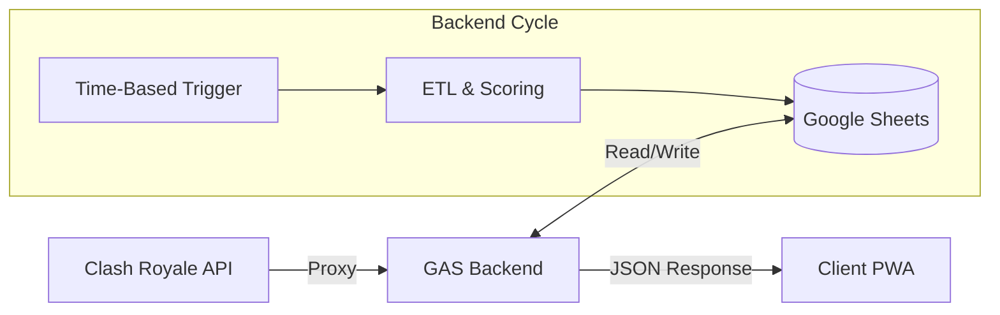

# Clash Manager Server (GAS)

<!-- Static badges for the backend as GAS doesn't have a package.json -->


[](https://github.com/albidr/Clash-Manager/blob/main/LICENSE)

**Clash Manager Server** is the backend engine powered by Google Apps Script. It acts as the API Gateway, ETL Pipeline, and Database (via Google Sheets) for the Clash Manager ecosystem.

Instead of serving HTML directly (standard GAS Web App), it operates as a **Headless API**, serving compressed JSON to the PWA frontend.

---

## 🏗️ Architecture



### Core Concepts
1.  **Cycle-Based Execution**: The system updates data on a schedule (Time-based triggers) or on-demand, rather than on every request.
2.  **Mutex Locking**: Uses `LockService` to prevents race conditions. If an update is running, subsequent requests wait or abort safely to prevent database corruption.
3.  **Key Rotation**: Rotates through a pool of API keys to respect Clash Royale API rate limits during heavy scanning operations.

---

## 🧩 Module Ecosystem

| File | Responsibility |
| :--- | :--- |
| **`API_Public`** | **Router**: Handles `doGet`/`doPost` and standardized JSON responses. |
| **`Controller_Webapp`** | **Data Layer**: Generates, compresses, and caches the frontend payload. |
| **`Recruiter`** | **Intelligence**: Runs the "Deep Net" tournament scan to find recruits. |
| **`Leaderboard`** | **Ranking**: Aggregates member stats and calculates war history. |
| **`Logger`** | **Database**: Handles daily snapshots and historical pruning. |
| **`ScoringSystem`** | **Math**: Isolated algorithms for player scoring (Protected Logic). |
| **`Orchestrator & Triggers`** | **Control**: Manages triggers, menus, and update sequences. |
| **`Utilities`** | **Core**: Fetching, backups, and shared helpers. |
| **`Configuration`** | **Config**: Central constants, schema definitions, and API keys. |

---

## 🚀 Setup Guide

<details>
<summary><strong>Click to view Deployment Instructions</strong></summary>

### 1. Installation
1.  Create a new **Google Sheet**.
2.  Navigate to **Extensions > Apps Script**.
3.  Copy the content of the `.gs.js` files into the editor (rename them to `.gs`).

### 2. Configuration
Open **Project Settings > Script Properties** and add the following keys:

| Property | Value |
| :--- | :--- |
| `ClanTag` | Your Clan Tag (e.g., `#29Uqq282`) |
| `CRK1` ... `CRK10` | Clash Royale Developer API Keys |
| `WebAppUrl` | (Optional) URL of the deployed PWA |

### 3. Deployment
1.  Click **Deploy > New Deployment**.
2.  Select type: **Web App**.
3.  Execute as: **Me** (The owner).
4.  Who has access: **Anyone** (Required for the PWA to fetch data via AJAX).

### 4. Initialization
1.  Refresh the Google Sheet.
2.  Locate the custom menu **👑 Clan Manager**.
3.  Run **"🛡️ Health Check"** to verify modules.
4.  Run **"🚀 Run Master Sequence"** to hydrate the database.
</details>

---

## 🔌 API Protocol

The backend exposes a single HTTP endpoint.

### Standard Envelope
```json
{
  "status": "success",
  "data": { ... },
  "error": null,
  "timestamp": "ISO_DATE_STRING"
}
```

### Endpoints
*   `GET ?action=getwebappdata`: Returns the monolithic, compressed data payload (Leaderboard + Recruits).
*   `GET ?action=ping`: System health check (returns version and status).
*   `POST`: Accepts JSON body `{ "action": "dismissRecruits", "ids": [...] }` to update the blacklist.

---

## 📄 License

Proprietary.
Copyright © 2026 AlbiDR.
