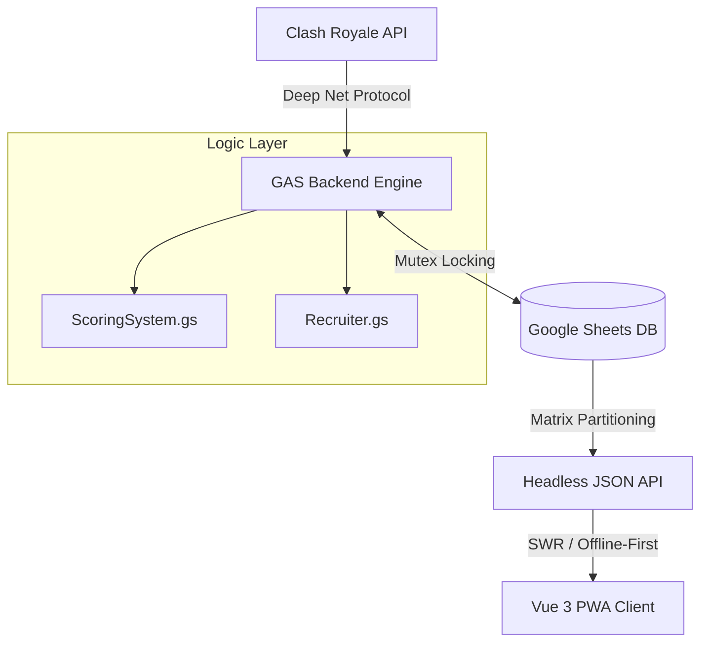

# Clash Manager: Clan Manager for Clash Royale

-FFD700?style=flat-square&logo=clashroyale&logoColor=white)

**Clash Manager** is a high-performance clan management suite for Clash Royale leaders. It bridges the gap between raw data analysis and a "Posh" mobile experience by combining a **Serverless Google Apps Script Backend** with a **Progressive Web App (PWA)**.

> [!IMPORTANT]
> This project is designed for "Posh" reliability. It features a **Portfolio Demo Mode** (Settings > Extra Features) that allows recruiters to explore the full interface with realistic mock data even when backend services are offline.

---

## 🏗️ Technical Architecture

Clash Manager uses a hybrid **SWR (Stale-While-Revalidate)** architecture. Google Sheets acts as the system of record (Database), while the GAS engine handles heavy ETL (Extract, Transform, Load) jobs.

### 🧠 The Scoring Engine (Performance Modeling)
Unlike basic stat trackers, Clash Manager uses a proprietary `ScoringSystem` to model a player's "True Value."

- **Hybrid Participation Logic**: 
    - *Grace Period*: During Training Days (Mon-Wed), 0 Fame is ignored to avoid penalizing players during cool-downs.
    - *Strict Mode*: During Battle Days (Thu-Sun), the denominator remains locked, causing scores to drop instantly if attacks are missed.
- **Inactivity Decay**: High-scoring players who stop playing have their scores decayed exponentially using the formula:  
  `FinalScore = RawScore * (1 - DecayRate)^(Days - GracePeriod)`

### 🔭 The Headhunter (Deep Net Protocol)
To find clanless talent, the recruiter module implements a recursive tournament scan:
1. **Keyword Broadcast**: Parallel search for all alphanumeric tournament tags.
2. **Stochastic Filter**: Randomly samples 150 tournaments from the top 800 by capacity.
3. **Log Extraction**: Fetches Battle Logs for 100+ clanless candidates to identify "War Activity" beyond simple trophy counts.

---

## 🔥 Key Frontend Features

### ✨ "Posh" Motion System
- **Auto-Animate**: Fluid, physics-based list transitions using `@formkit/auto-animate`. Sorting members or recruits feels premium and tactile.
- **Glassmorphism**: A curated M3-inspired theme with obsidian depth and tonal palettes.
- **Haptic Feedback**: Standardized vibration patterns for selections, successes, and errors.

### 🛡️ Safety & Reliability
- **Error Boundaries**: Component-level recovery. If a view fails, the app catches the exception and offers a "System Recovery" state rather than crashing.
- **Offline-First**: Powered by Service Workers and IndexedDB. You can view your clan data mid-flight or in low-connectivity areas.

---

## 📂 Monorepo Structure

- **[`/Backend-GAS`](./Backend-GAS)**: Google Apps Script source code.
    - `Controller`: Data compression and JSON matrix generation.
    - `ScoringSystem`: Pure mathematical logic.
    - `Leaderboard`: Weekly aggregation and history rehydration.
- **[`/Frontend-PWA`](./Frontend-PWA)**: Vue 3 + Vite PWA.
    - `src/composables`: Logic extraction (useDemoMode, useClanData, useHaptics).
    - `src/utils/mockData`: The engine powering the Portfolio Demo Mode.

---

## 🚀 Getting Started

1. **Deploy Backend**: Follow the [Backend Guide](./Backend-GAS/README%20(GAS).md).
2. **Deploy Frontend**: Follow the [Frontend Guide](./Frontend-PWA/README%20(PWA).md).
3. **Demo Mode**: If you are exploring this repo for a portfolio review, toggle the "Portfolio Demo Mode" in **Settings > Extra Features** on the live site.

---

## 📄 License

Proprietary.  
Copyright © 2026 AlbiDR.
